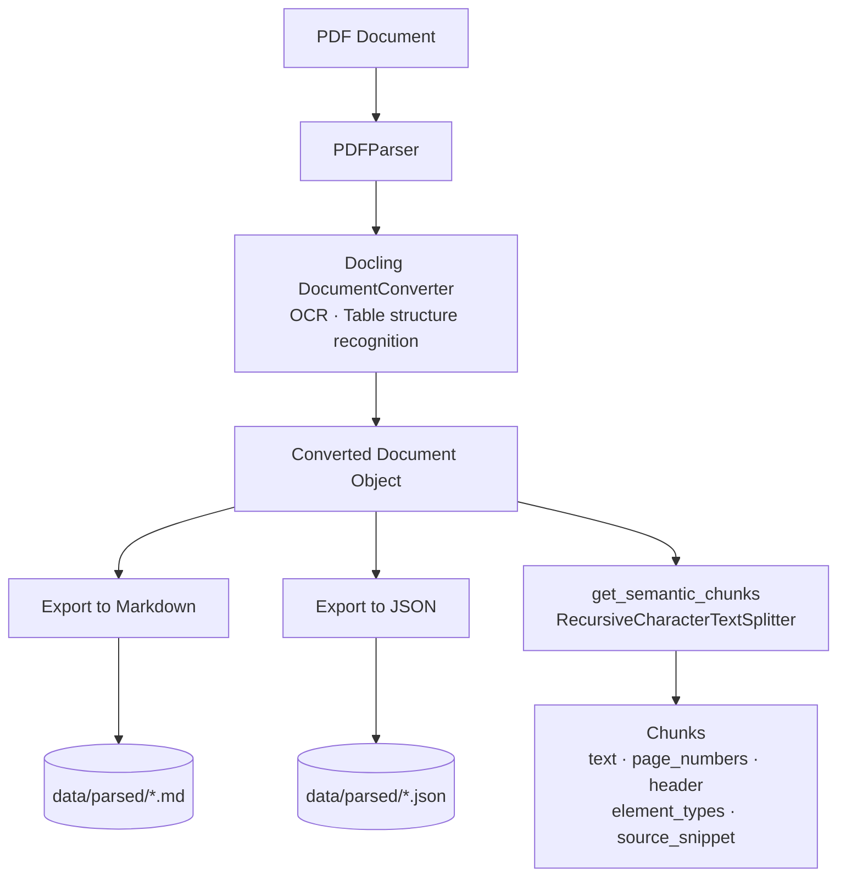
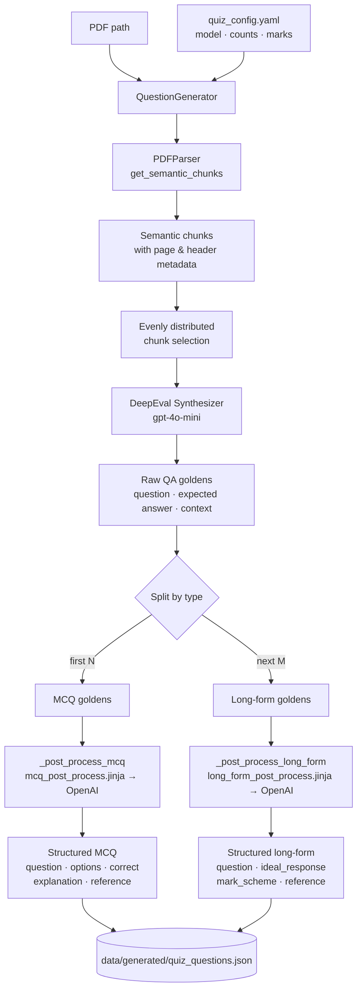
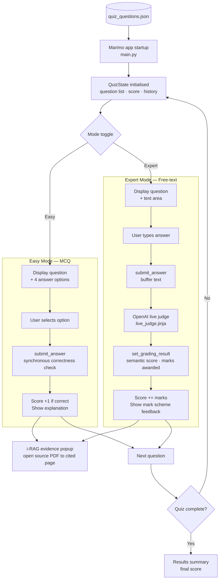

# RAG Quiz Builder

An AI-powered quiz application that turns dense PDF documents into interactive learning tools. It parses source material with high-fidelity OCR, generates multiple-choice and long-form questions using a RAG pipeline, and serves a reactive quiz UI with real-time semantic grading.

## How it works

1. **Parse** — IBM Docling converts a PDF into semantically chunked text, preserving page numbers and headings.
2. **Generate** — DeepEval's Synthesizer produces raw question–answer pairs from the chunks, which are then shaped into structured MCQ and long-form questions via Jinja2 prompt templates.
3. **Quiz** — A Marimo reactive notebook serves the quiz in two modes:
   - **Easy** — multiple-choice with immediate correctness feedback.
   - **Expert** — free-text answers graded in real time by an OpenAI-backed semantic judge.
   - An **i-RAG** evidence popup opens the source PDF to the exact page that informed each question.

Detailed flow diagrams for each phase are included in the step-by-step guide below.

---

## Setup

### Prerequisites

- Python 3.14+
- [`uv`](https://github.com/astral-sh/uv) — install with `curl -LsSf https://astral.sh/uv/install.sh | sh`
- An OpenAI API key

### Install

```bash
git clone <repo-url>
cd rag_quizzer
uv sync
```

### Environment variables

Create a `.env` file in the project root:

```
OPENAI_API_KEY=sk-...
```

---

## Quickstart

Place your PDF in `data/documents/`, then run the full pipeline:

```bash
# 1. Generate questions from the document
python scripts/generate_quiz.py --pdf data/documents/your_document.pdf

# 2. Launch the quiz app
marimo run main.py
```

Open the URL printed by Marimo in your browser. To edit the notebook itself, use `marimo edit main.py` instead.

---

## Step-by-step guide

### 1. Parse a document

The parser converts a PDF to Markdown and JSON and saves both to `data/parsed/`. Parsing enables OCR and table structure recognition by default.



```bash
python scripts/parse_guide.py
```

> **Note:** `parse_guide.py` currently uses a hardcoded path (`data/documents/SoFC26_Guide.pdf`). Edit the `pdf_path` variable at the top of the script to point at your document, or use the parser directly from Python:

```python
from ai_quizzer.pdf_parser import PDFParser
from pathlib import Path

parser = PDFParser()
saved = parser.parse_and_save(
    pdf_path=Path("data/documents/your_document.pdf"),
    output_dir=Path("data/parsed"),
)
print(saved)  # {'markdown': ..., 'json': ...}
```

### 2. Generate questions

Question generation parses the PDF, synthesises raw QA pairs, and writes structured questions to the output path configured in `quiz_config.yaml` (default: `data/generated/quiz_questions.json`).



```bash
python scripts/generate_quiz.py \
  --pdf data/documents/your_document.pdf \
  --config quiz_config.yaml
```

Override question counts without editing the config:

```bash
python scripts/generate_quiz.py --pdf data/documents/your_document.pdf --mcqs 10 --lf 5
```

| Flag | Default | Description |
|---|---|---|
| `--pdf` | `data/documents/SoFC26_Guide.pdf` | Path to the source PDF |
| `--config` | `quiz_config.yaml` | Path to the configuration file |
| `--mcqs` | from config | Override number of MCQ questions |
| `--lf` | from config | Override number of long-form questions |

### 3. Run the quiz app



```bash
# Serve the quiz (read-only, production-style)
marimo run main.py

# Open the interactive notebook editor
marimo edit main.py
```

The app loads `data/generated/quiz_questions.json` at startup. Toggle between **Easy** (MCQ) and **Expert** (free-text) modes using the control at the top of the page.

---

## Configuration

All generation behaviour is controlled by `quiz_config.yaml`:

```yaml
model_name: "gpt-4o-mini"          # OpenAI model used for generation and grading
output_path: "data/generated/quiz_questions.json"  # Where generated questions are saved

question_types:
  mcq:
    count: 20                       # Number of multiple-choice questions to generate
    distractor_count: 3             # Number of incorrect answer options per question

  long_form:
    count: 10                       # Number of long-form questions to generate
    max_marks: 5                    # Maximum marks awarded by the live judge
    target_length_min: 50           # Minimum expected answer length (words)
    target_length_max: 200          # Maximum expected answer length (words)
    rubric_detail: "concise"        # Grading rubric verbosity: "concise" or "detailed"
```

**Cost note:** Each generation run makes multiple OpenAI API calls. Reduce `count` values for faster, cheaper runs during development.

---

## Project structure

```
ai_quizzer/          # Core library
  pdf_parser.py      # PDFParser — Docling-based parsing and chunking
  question_generator.py  # QuestionGenerator — synthesis and post-processing
  quiz_logic.py      # QuizState — session state dataclass
  prompts/           # Jinja2 prompt templates

scripts/
  generate_quiz.py   # CLI entry point for question generation
  parse_guide.py     # Standalone PDF parsing utility

data/
  documents/         # Source PDFs (not committed)
  parsed/            # Docling output (Markdown + JSON)
  generated/         # quiz_questions.json

main.py              # Marimo quiz application
quiz_config.yaml     # Generation configuration
```
