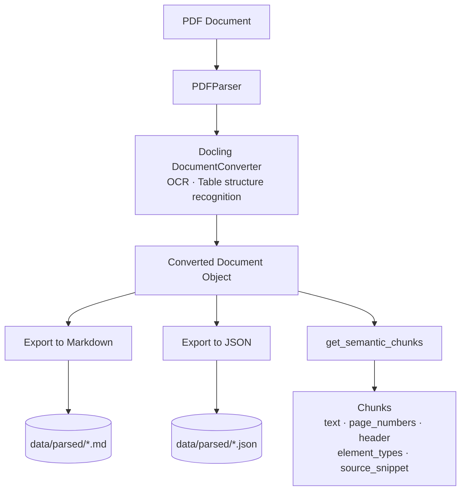
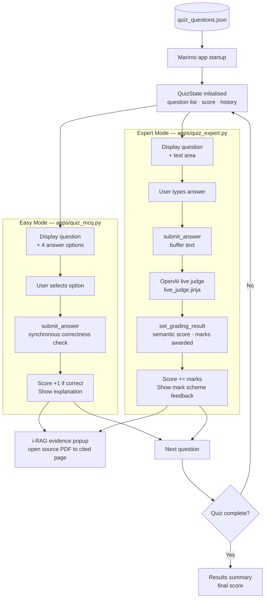

# PyData AI-Generated Quiz

A demo project built for **PyData London 2026** that turns a dense PDF document into an interactive quiz using a three-stage AI pipeline. The bundled example uses the [ComplyAdvantage State of Financial Crime 2026 report](https://www.complyadvantage.com/resource/state-of-financial-crime-2026/) as its source document, but the pipeline works with any PDF.

## How it works

1. **Parse** — IBM Docling converts a PDF into semantically chunked text, walking the document's own heading hierarchy to keep tables, lists, and paragraphs together under their logical sections. Each chunk carries its page number and section header as metadata.
2. **Generate** — DeepEval's Synthesiser produces raw question–answer pairs from the chunks. A two-stage post-processing step (Jinja2 prompt templates + OpenAI JSON mode) shapes these into structured MCQ and long-form questions, with source coordinates baked into every question.
3. **Quiz** — Two Marimo reactive apps serve the quiz:
   - **Easy mode** (`apps/quiz_mcq.py`) — multiple-choice with immediate correctness feedback.
   - **Expert mode** (`apps/quiz_expert.py`) — free-text answers graded in real time by an OpenAI-backed semantic judge against a structured mark scheme.
   - Both modes include an **i-RAG evidence popup** that opens the source PDF to the exact page that informed each question.

---

## Example dataset

The bundled questions and parsed data are generated from the **ComplyAdvantage State of Financial Crime 2026** report. The full report is freely available at:

> https://get.complyadvantage.com/insights/the-state-of-financial-crime-2026

This document is used here as a demonstration of the pipeline on a real-world, complex, long-form PDF. It remains the copyright material of ComplyAdvantage. If you intend to redistribute the parsed output or generated questions, please refer to ComplyAdvantage's terms of use.

---

## Setup

### Prerequisites

- Python 3.14+
- [`uv`](https://github.com/astral-sh/uv) — install with `curl -LsSf https://astral.sh/uv/install.sh | sh`
- An OpenAI API key

### Install

```bash
git clone https://github.com/Cadarn/PyData-AI-Generated-Quiz.git
cd PyData-AI-Generated-Quiz
uv sync
```

### Environment variables

Create a `.env` file in the project root:

```
OPENAI_API_KEY=sk-...
```

---

## Quickstart

The repo includes pre-generated questions from the SoFC 2026 report so you can run the quiz immediately without an API call:

```bash
# Easy mode — multiple choice
marimo run apps/quiz_mcq.py

# Expert mode — free-text with live grading
marimo run apps/quiz_expert.py
```

To generate questions from your own PDF:

```bash
python scripts/generate_quiz.py --pdf data/documents/your_document.pdf
```

Then relaunch either app — it picks up the new `quiz_questions.json` automatically.

---

## Step-by-step guide

### 1. Parse a document

The parser converts a PDF to Markdown and JSON, saving both to `data/parsed/`. OCR and table structure recognition are enabled by default.



```bash
python scripts/parse_guide.py
```

> **Note:** `parse_guide.py` has a hardcoded path (`data/documents/SoFC26_Guide.pdf`). Edit `pdf_path` at the top of the script for a different document, or use the parser directly:

```python
from ai_quizzer.pdf_parser import PDFParser
from pathlib import Path

parser = PDFParser()
saved = parser.parse_and_save(
    pdf_path=Path("data/documents/your_document.pdf"),
    output_dir=Path("data/parsed"),
)
```

### 2. Generate questions

Question generation parses the PDF, synthesises raw QA pairs via DeepEval, and writes structured questions to `data/generated/quiz_questions.json`.


```bash
python scripts/generate_quiz.py \
  --pdf data/documents/your_document.pdf \
  --config quiz_config.yaml
```

Override question counts without editing the config:

```bash
python scripts/generate_quiz.py --pdf data/documents/your_document.pdf --mcqs 10 --lf 5
```

| Flag | Default | Description |
|---|---|---|
| `--pdf` | `data/documents/SoFC26_Guide.pdf` | Path to the source PDF |
| `--config` | `quiz_config.yaml` | Path to the configuration file |
| `--mcqs` | from config | Override number of MCQ questions |
| `--lf` | from config | Override number of long-form questions |

### 3. Run the quiz



```bash
# Easy mode — multiple choice with instant feedback
marimo run apps/quiz_mcq.py

# Expert mode — free-text with live AI grading
marimo run apps/quiz_expert.py
```

Both apps load `data/generated/quiz_questions.json` at startup. If the file is missing, they fall back to a set of built-in example questions so the app is always runnable.

---

## Configuration

All generation behaviour is controlled by `quiz_config.yaml`:

```yaml
model_name: "gpt-4o-mini"          # OpenAI model used for generation and grading
output_path: "data/generated/quiz_questions.json"
pdf_path: "data/documents/SoFC26_Guide.pdf"

question_types:
  mcq:
    count: 20                       # Number of multiple-choice questions
    distractor_count: 3             # Number of incorrect options per question

  long_form:
    count: 10                       # Number of long-form questions
    max_marks: 5                    # Maximum marks awarded by the live judge
    target_length_min: 50           # Minimum expected answer length (words)
    target_length_max: 200          # Maximum expected answer length (words)
    rubric_detail: "concise"        # Grading rubric verbosity: "concise" or "detailed"
```

**Cost note:** Each generation run makes multiple OpenAI API calls. Use `--mcqs 5 --lf 2` for quick test runs.

---

## Project structure

```
ai_quizzer/               # Core library
  pdf_parser.py           # PDFParser — Docling-based parsing and semantic chunking
  question_generator.py   # QuestionGenerator — synthesis and post-processing pipeline
  quiz_logic.py           # QuizState — session state dataclass
  quiz_data.py            # Question loader with fallback examples
  grader.py               # Live judge — OpenAI-backed rubric grader
  prompts/                # Jinja2 prompt templates
    mcq_post_process.jinja
    long_form_post_process.jinja
    live_judge.jinja
    style_guide.jinja     # Shared style rules included by all templates

apps/
  quiz_mcq.py             # Easy mode Marimo app
  quiz_expert.py          # Expert mode Marimo app

scripts/
  generate_quiz.py        # CLI entry point for question generation
  parse_guide.py          # Standalone PDF parsing utility
  inspect_document.py     # Debug utility — prints Docling document tree
  localize_existing_quiz.py  # Post-processing script to enforce British English

data/
  documents/              # Source PDFs
  parsed/                 # Docling output (Markdown + JSON)
  generated/              # quiz_questions.json

docs/
  pdf_model_pop.md        # Lessons learned: Marimo PDF modal patterns

tests/                    # pytest test suite
quiz_config.yaml          # Generation configuration
```

---

## Key technical decisions

**Structure-aware chunking over character splitting** — `PDFParser.get_semantic_chunks()` walks Docling's document node tree and accumulates content under section headers rather than splitting on character count. This keeps tables and lists together with their context and produces significantly better question quality.

**Two-stage question generation** — The DeepEval Synthesiser anchors a factual QA pair (Stage 1); a separate Jinja2-templated OpenAI call shapes it into the target schema with plausible distractors and source citations (Stage 2). Separating fact from format makes each stage independently debuggable and iterable.

**i-RAG at generation time** — Rather than retrieving evidence at query time via a vector store, source coordinates (`page_numbers`, `section`, `source_snippet`) are embedded into every question during generation. The evidence popup is a simple JSON read — no Chroma or embedding infrastructure needed.

**LLM-as-judge with structured rubrics** — Expert mode grades free-text answers against a per-criterion mark scheme (one sentence = one mark). This gives consistent, auditable scores with natural-language rationale, which keyword matching or Levenshtein distance cannot provide.
